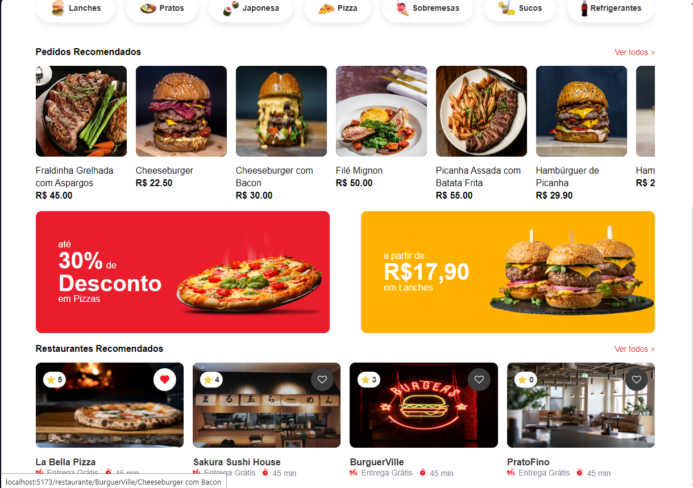
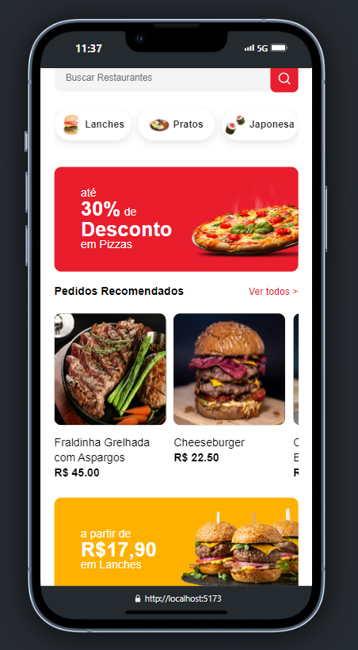
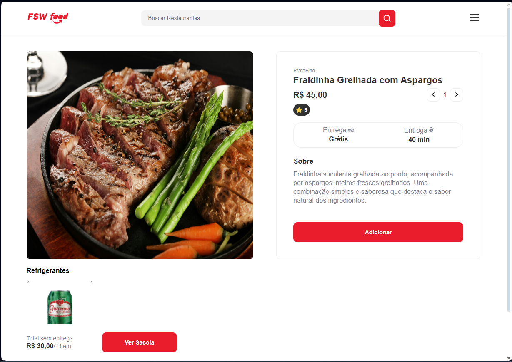
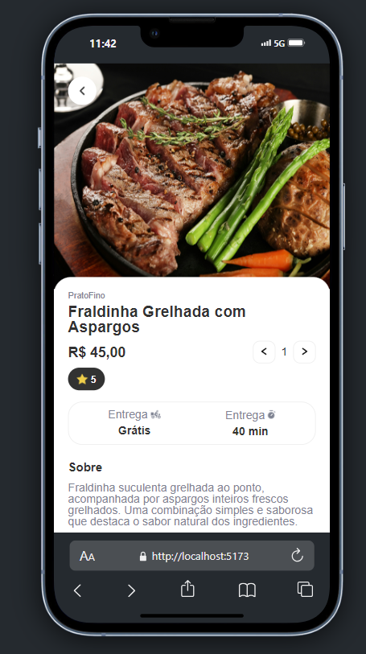
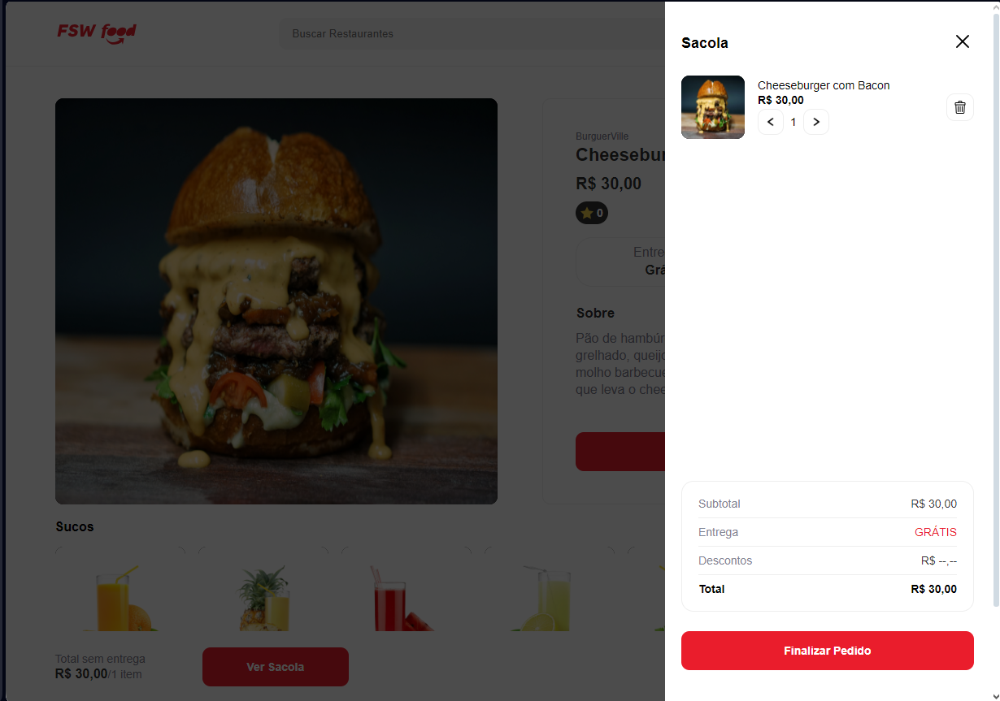
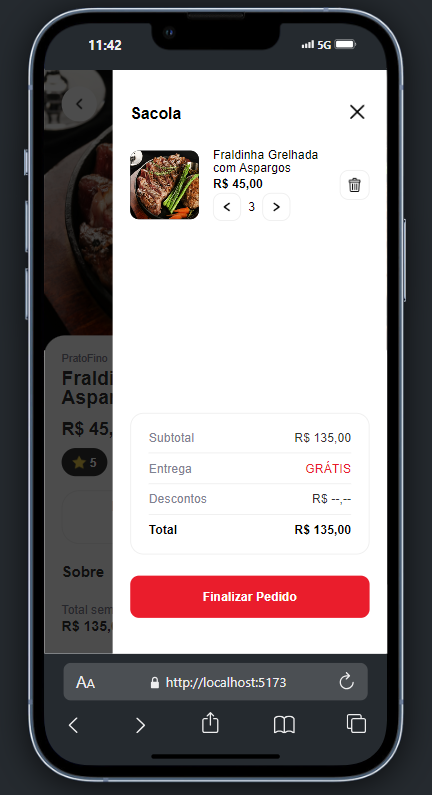

# Restaurante Web App

Este é um aplicativo web desenvolvido em React que consome uma API de administração de pedidos para restaurantes.
[API](https://github.com/DaviARC/api-node-express-restaurante)

## Funcionalidades

- **Exibição de Restaurantes**: Navegue e explore uma lista de restaurantes.
- **Produtos por Restaurante e Categoria**: Veja os produtos de cada restaurante e filtre por categorias.
- **Login com Google**: Autenticação rápida e segura usando sua conta Google.
- **Favoritar Restaurantes**: Marque seus restaurantes preferidos para fácil acesso.
- **Avaliação**: Avalie tanto os restaurantes quanto os itens do cardápio.
- **Manipulação de Sacola**: Adicione, remova e gerencie itens na sacola de compras.
- **Finalização de Pedido**: Complete o processo de compra e finalize seu pedido.

## Tecnologias Utilizadas

- **React**: Framework JavaScript para construção de interfaces de usuário.
- **React Router**: Gerenciamento de rotas.
- **Axios**: Para consumo da API.
- **Firebase Authentication**: Implementação do login com Google.
- **Styled Components**: Estilização dos componentes.

## Telas
### Tela Principal

### Tela do Produto

### Sacola

